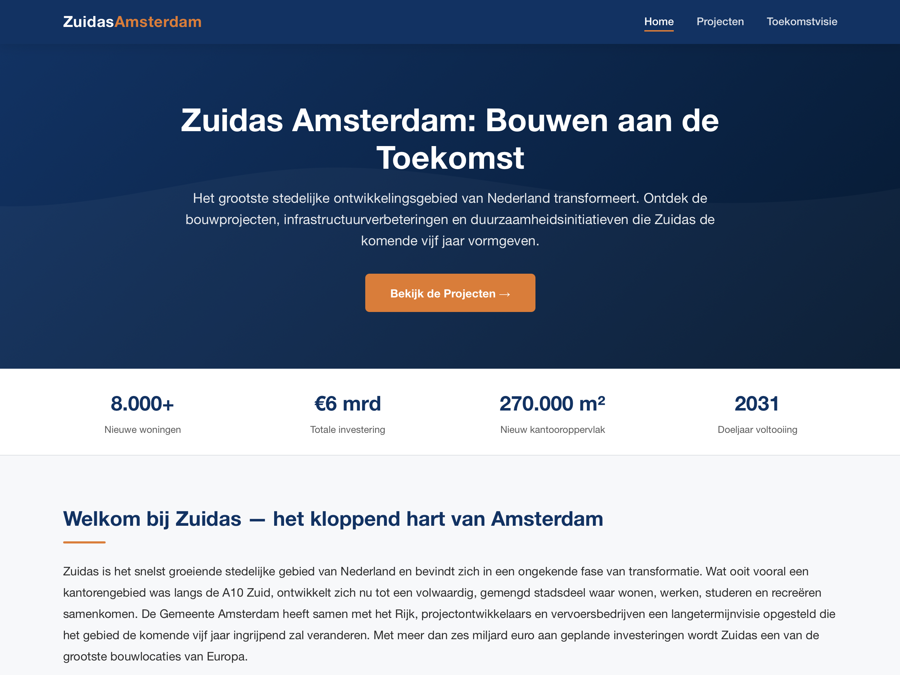
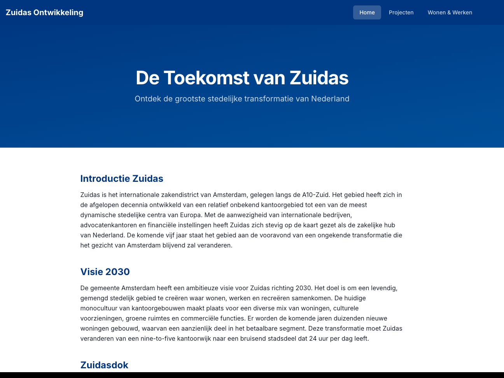
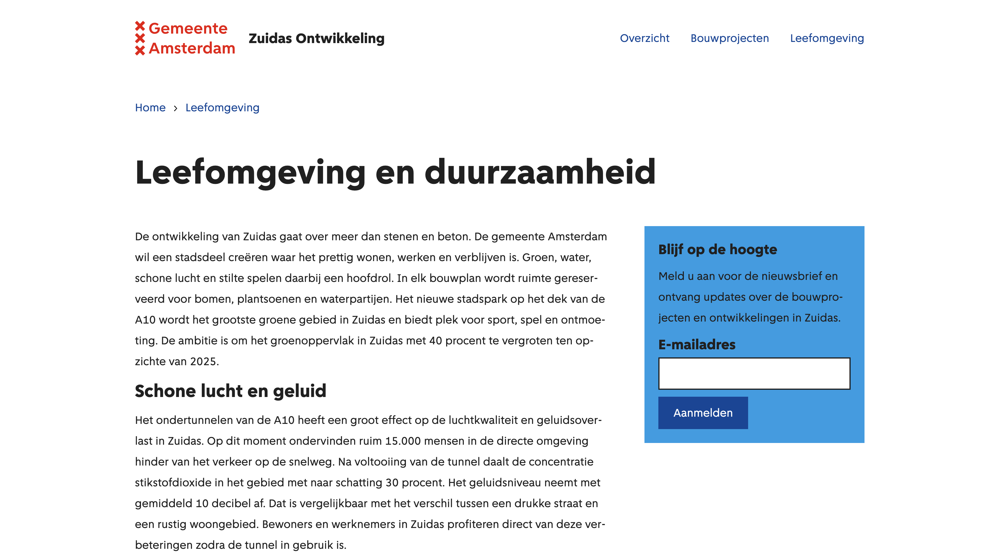

# Amsterdam Agent Skills

Open-source agent skills by the Municipality of Amsterdam. Skills are knowledge modules that give AI coding assistants context-aware expertise — automatically activated when relevant to the task at hand.

Compatible with Claude Code, GitHub Copilot, and other tools that support skill/instruction files.

## Quick Install

Install skills with [`npx skills`](https://github.com/vercel-labs/skills):

```bash
# Install all skills from this repo
npx skills add amsterdam/amsterdam-agent-skills

# Install a specific skill
npx skills add amsterdam/amsterdam-agent-skills --skill amsterdam-design-system

# Install for a specific agent
npx skills add amsterdam/amsterdam-agent-skills -a github-copilot

# Preview available skills without installing
npx skills add amsterdam/amsterdam-agent-skills --list
```

## Manual Setup

Each skill lives in `skills/<name>/SKILL.md`. How you load them depends on your tool:

| Tool | Setup |
|------|-------|
| GitHub Copilot | Reference in `.github/copilot-instructions.md` |
| Claude Code | Symlink into `~/.claude/skills/` |

**GitHub Copilot example:**

```bash
# Copy skill files into .github/instructions/
for skill in skills/*/; do
  cp "$skill/SKILL.md" ".github/instructions/$(basename "$skill").instructions.md"
done
```

## Skills

| Skill | Description | Updated |
|-------|-------------|---------|
| [amsterdam-design-system](skills/amsterdam-design-system/) | Gemeente Amsterdam design system — React components, `--ams-*` tokens, Grid layout, Spacious/Compact modes, Tailwind v4 bridge | 2026-04-03 |
| [amsterdam-stijl](skills/amsterdam-stijl/) | Amsterdam municipality writing style — Heldere Taal (B1), Eenvoudige Taal (A2), inclusive language, tone of voice, word choice, text templates | 2026-04-01 |
| [developers-amsterdam](skills/developers-amsterdam/) | Gemeente Amsterdam engineering standards — approved tech stacks, Git workflow, testing requirements, security-by-design, documentation standards, EU-PL v1.2, WCAG 2.1 AA | 2026-04-01 |

## Benchmark: Do Skills Actually Work?

> **Live showcase:** [amsterdam.github.io/amsterdam-agent-skills](https://amsterdam.github.io/amsterdam-agent-skills/) — interactive gallery, prev/next through every prototype.

We gave the same model (Claude Opus 4.6) the same vague prompt — *"build me a landing page for the Amsterdam Zuidas area"* — under three configurations. The prompt mentioned no design system, no component library, no language guidelines. Results:

| | No Skills | Default Skills | Amsterdam Skills |
|--|-----------|---------------|-----------------|
| **Score** | 12/28 | 10/28 | **26/28** |
| **Time** | 4m 21s | 7m 10s+ | 5m 28s |
| **Passes needed** | 1 | 2 | 1 |
| **Input tokens** | 391K | 1.8M (2 passes) | 1.8M |
| **Design system** | None | None | ADS components + tokens |
| **Language quality** | Marketing-speak | Formal, complex | Heldere Taal (B1) |

<table>
<tr>
<td><strong>No Skills (12/28)</strong><br>Static HTML, generic corporate palette, emoji, marketing Dutch<br></td>
<td><strong>Default Skills (10/28)</strong><br>Next.js+Tailwind, bare on first pass, generic blue on second<br></td>
<td><strong>Amsterdam Skills (26/28)</strong><br>ADS React, XXX logo, Amsterdam Sans, Heldere Taal, one-shot<br></td>
</tr>
</table>

Generic best-practice skills scored *worse* than no skills — more tokens, more time, an extra pass, and still no domain knowledge. Domain-specific skills hit 26/28 in a single shot.

Full methodology and scoring: [`benchmarks/001-zuidas-landing-page/`](benchmarks/001-zuidas-landing-page/)

### Reproducing benchmarks

The runner is a Bun CLI that wraps the GitHub Copilot CLI. Run any benchmark variant against your own Copilot install with one command:

```bash
cd tools/bench
bun install

# Build one prototype
bun run src/cli.ts run 001 --variant copilot_claude-opus-4-6_amsterdam

# Build the entire matrix
bun run src/cli.ts matrix 001

# Score with the LLM judge
bun run src/cli.ts judge 001
```

Outputs land under `benchmarks/{slug}/prototypes/{variant}/` as iframable static bundles. The Astro showcase at `site/` reads them via `benchmarks/benchmarks.json`. Full reference: [`tools/bench/README.md`](tools/bench/README.md).

## Structure

```
skills/                         # The skills themselves
├── amsterdam-design-system/    # AMS React + tokens + layout
├── amsterdam-stijl/            # Writing style, tone, language guidelines
└── developers-amsterdam/       # Engineering standards (developers.amsterdam)

benchmarks/                     # Reproducible benchmark definitions + outputs
├── 001-zuidas-landing-page/
│   ├── benchmark.yaml          # Prompt, variants matrix, scoring rubric
│   ├── benchmark.md            # Human prose narrative
│   ├── prototypes/             # Built static bundles (one per variant)
│   └── legacy-screenshots/     # Pre-runner manual captures
└── benchmarks.json             # Manifest the showcase reads (generated)

tools/bench/                    # Bun CLI runner (wraps the Copilot CLI)
└── src/cli.ts                  # bench run | matrix | judge | manifest | list

site/                           # Astro showcase site (deployed to GH Pages)
└── src/pages/
    ├── index.astro             # Grid of benchmark cards
    └── benchmark/[slug]/[variant].astro  # iframe + overlay toolbar
```

## Adding a New Skill

1. Create `skills/my-skill/SKILL.md` with a clear description and instructions
2. Add reference files in `skills/my-skill/references/` if needed
3. Update this README table

## License

Licensed under the [European Union Public Licence v1.2](LICENSE) (EU-PL v1.2).
