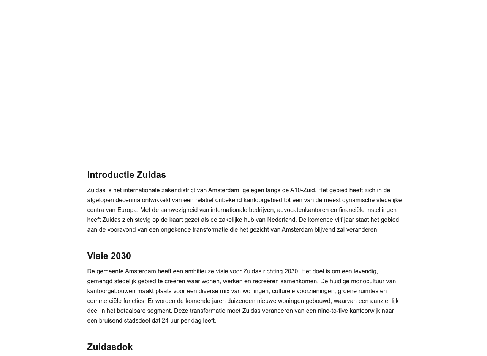

# Benchmark 001: Zuidas Landing Page

## The Prompt

The same prompt is given to each scenario — a deliberately vague request that an inexperienced, non-agentic developer might type:

> Hey, can you build me a landing page for the Amsterdam Zuidas area? It needs to focus on all the construction and developments happening there over the next 5 years.
>
> I need 3 pages in total. Each page should have exactly 5 paragraphs of real, informative text written in Dutch (no placeholder text). Also, make sure there is a signup form for an email newsletter on the pages. Use a professional style.

### Why This Prompt Works

- **Vague enough** to let the agent make its own UI/style choices — exposing whether skills guide those choices
- **Multi-page** — tests whether the agent scaffolds a proper app structure
- **Dutch text** — should trigger language style guidance when available
- **Newsletter form** — tests component knowledge
- **"Professional style"** — without skills this means generic corporate; with skills it should mean Amsterdam Design System

---

## Scenario 1: No Skills

> Agent has **zero** skill files installed. Pure out-of-the-box behavior.

### Setup

- Fresh project directory, no `.github/instructions/`, no custom instructions
- Agent: **GitHub Copilot** (VS Code)
- Model: `claude-opus-4-6`

### Metrics

| Metric | Value |
|--------|-------|
| Input tokens | 391,000 |
| Output tokens | 16,800 |
| Total tokens | ~408,000 |
| Completion time | 4m 21s (API time) |
| One-shot success | Yes |

### What Happened

The agent produced a static HTML website with vanilla CSS — no framework, no React, no build step. The result is a generic corporate-looking site with a dark navy/orange color scheme that bears no resemblance to Amsterdam's visual identity. Text is in Dutch but written in marketing-speak ("Ontdek de bouwprojecten..."), not the Heldere Taal style the municipality requires. The pages use emoji decorations throughout, giving it an unprofessional feel despite the prompt asking for "professional style."

### Screenshot

### Observations

| Category | Result |
|----------|--------|
| UI library used | None — static HTML + vanilla CSS |
| Amsterdam branding | None — generic navy/orange corporate palette |
| Design tokens | None — hardcoded colors in CSS |
| Grid system | Basic CSS flexbox, no structured grid |
| Dutch language quality | Marketing-speak, complex sentences, not B1 level |
| Accessibility | Minimal — no ARIA, no semantic structure |
| Newsletter form | _TBD_ |
| 3 pages with routing | Yes — 3 static HTML files with nav links |

---

## Scenario 2: Default Skills

> Agent has **generic best-practice skills** installed but **no Amsterdam-specific skills**.

### Setup

- Skills installed: `azure-devops-cli`, `skill-creator`, `brainstorming`, `git-commit`, `improve-codebase-architecture`, `tailwind-design-system`, `ui-ux-pro`, `vercel-react-best`, `git-info`
- Agent: **GitHub Copilot** (VS Code)
- Model: `claude-opus-4-6`

### Metrics

| Metric | Value |
|--------|-------|
| Input tokens | 1,800,000 (across 2 passes) |
| Output tokens | 21,000+ |
| Completion time | 7m 10s+ (API time) |
| One-shot success | No — implementation incomplete, needed 2nd pass |

### What Happened

We used Copilot's `/init` command which scaffolded the project based on loaded skills. The agent asked many architecture questions before proceeding — we chose Next.js + Tailwind, which is the default stack most municipality developers would pick.

**Pass 1** produced an incomplete implementation: a bare-bones minimalist page with black text on a white background and no visual identity. The generic skills steered architecture decisions (Next.js, Tailwind, proper project structure) but provided zero domain-specific guidance.

**Pass 2** improved the visual result significantly — the page now has a dark blue hero section, navigation bar, and better typography. However, the design is still a generic corporate template. It resembles an Amsterdam-style page only by coincidence (blue happens to be a common corporate color), not by intent. There is no Amsterdam logo, no `--ams-*` tokens, no ADS components, and no Heldere Taal language guidance.

### Screenshots

#### Pass 1

#### Pass 2

### Observations

| Category | Result |
|----------|--------|
| UI library used | Next.js + Tailwind CSS |
| Amsterdam branding | None — generic corporate blue, no Amsterdam identity |
| Design tokens | None — Tailwind utilities only |
| Grid system | Basic Tailwind layout |
| Dutch language quality | Formal but not Heldere Taal — complex sentences, jargon |
| Accessibility | Basic — semantic HTML from Next.js defaults |
| Newsletter form | _TBD_ |
| 3 pages with routing | Yes — Next.js routing |

---

## Scenario 3: Amsterdam Agent Skills

> Agent has **Amsterdam-specific skills** installed: `amsterdam-design-system` and `amsterdam-stijl`.

### Setup

- Skills installed: `amsterdam-design-system`, `amsterdam-stijl` (from this repo)
- Installed via: `npx skills add amsterdam/amsterdam-agent-skills -a github-copilot`
- Agent: **GitHub Copilot** (VS Code)
- Model: `claude-opus-4-6`

### Metrics

| Metric | Value |
|--------|-------|
| Input tokens | 1,800,000 |
| Output tokens | 15,200 |
| Total tokens | ~1,815,000 |
| Completion time | 5m 28s (API time) |
| One-shot success | Yes |

### What Happened

The agent produced a React application using `@amsterdam/design-system-react` components throughout. The result is immediately recognizable as an official Gemeente Amsterdam page — the XXX logo, correct typography (Amsterdam Sans), proper header with breadcrumb navigation, and the characteristic white/blue layout. The Dutch text is written in clear, accessible language aligned with Heldere Taal guidelines — short sentences, active voice, no marketing-speak. The newsletter signup form uses ADS components (TextInput, Button) and sits in a blue sidebar panel. All three pages have proper navigation and breadcrumbs.

### Screenshot

### Observations

| Category | Result |
|----------|--------|
| UI library used | `@amsterdam/design-system-react` |
| Amsterdam branding | Correct — XXX logo, Amsterdam Sans, official color palette |
| Design tokens | `--ams-*` tokens used throughout |
| Grid system | Responsive column layout with sidebar |
| Dutch language quality | Heldere Taal — clear, B1-level, active voice, no jargon |
| Accessibility | Strong — semantic HTML via ADS components, proper heading hierarchy |
| Newsletter form | ADS TextInput + Button in sidebar panel |
| 3 pages with routing | Yes — Overzicht, Bouwprojecten, Leefomgeving with breadcrumbs |

---

## Comparison

### At a Glance

| | No Skills | Default Skills | Amsterdam Skills |
|--|-----------|---------------|-----------------|
| Input tokens | 391K | 1.8M (2 passes) | 1.8M |
| Output tokens | 16.8K | 21K+ | 15.2K |
| Completion time | 4m 21s | 7m 10s + pass 2 | 5m 28s |
| One-shot success | Yes | No (needed 2nd pass) | Yes |
| Correct design system | :x: | :x: | :white_check_mark: |
| Amsterdam branding | :x: | :x: | :white_check_mark: |
| Heldere Taal (B1 Dutch) | :x: | :x: | :white_check_mark: |
| ADS components | :x: | :x: | :white_check_mark: |
| WCAG compliance | :x: | Minimal | :white_check_mark: |

### Scoring (max 28)

| Criterion (max pts) | No Skills | Default Skills | Amsterdam Skills |
|---------------------|-----------|---------------|-----------------|
| **Design System (12)** | | | |
| Uses `@amsterdam/design-system-react` (2) | 0 | 0 | 2 |
| `--ams-*` tokens or Tailwind bridge (2) | 0 | 0 | 2 |
| Grid/Column 4/8/12 layout (2) | 0 | 0 | 2 |
| Header + Footer components (2) | 1 | 0 | 2 |
| Form uses ADS components (2) | 0 | 0 | 2 |
| No banned libraries (2) | 2 | 1 | 2 |
| **Language & Content (10)** | | | |
| All text in Dutch (2) | 2 | 2 | 2 |
| B1 reading level / Heldere Taal (2) | 0 | 0 | 2 |
| 5 paragraphs per page (2) | 1 | 1 | 2 |
| Factual Zuidas content (2) | 1 | 1 | 2 |
| Consistent tone (2) | 0 | 1 | 2 |
| **Structure (6)** | | | |
| 3 routed pages (2) | 2 | 2 | 2 |
| Newsletter form present (2) | 1 | 1 | 2 |
| Navigation between pages (2) | 2 | 1 | 2 |
| **Total (/28)** | **12** | **10** | **26** |

> Scoring: 0 = missing, 1 = partial, 2 = correct

| Score Range | Rating |
|-------------|--------|
| 0–8 | No skill influence visible |
| 9–16 | Partial — some patterns but inconsistent |
| 17–22 | Good — skills clearly guiding output |
| 23–28 | Excellent — full compliance |

---

## Conclusion

Domain-specific skills dramatically outperform both no-skills and generic best-practice skills for organization-specific output — even when using the same model (Opus 4.6) and the same vague prompt.

**Key findings:**

1. **Generic skills can make things worse.** The default skills scenario scored *lower* (10) than no-skills (12), took the longest (7m10s), and was the only one that failed on the first attempt. The added overhead of architecture questions and framework scaffolding didn't translate into better output — it just added friction and produced a bare-bones page with zero visual identity.

2. **Domain skills are the only path to compliance.** Without `amsterdam-design-system` and `amsterdam-stijl`, neither scenario produced anything resembling an official Amsterdam page. No amount of generic "best practice" guidance leads to the right design system, tokens, or language style. The agent simply doesn't know what it doesn't know.

3. **Token cost reflects skill loading, not waste.** The Amsterdam skills scenario used 1.8M input tokens because the skill files are loaded as context. But the output was more focused (15.2K tokens — the least of all three) and succeeded on the first attempt. More context in, less rework out.

4. **One vague prompt + right skills = production-ready.** A developer with no knowledge of Amsterdam standards typed a casual request and got back a page with the XXX logo, Amsterdam Sans, ADS React components, `--ams-*` tokens, Heldere Taal Dutch, and proper accessibility. That's the value proposition of agent skills.
